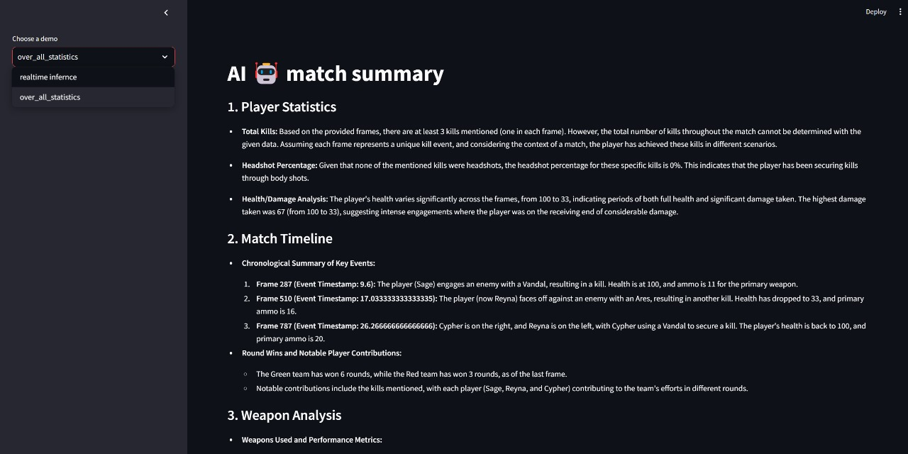
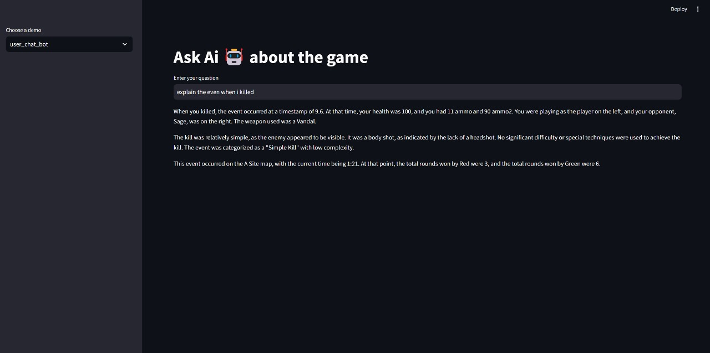
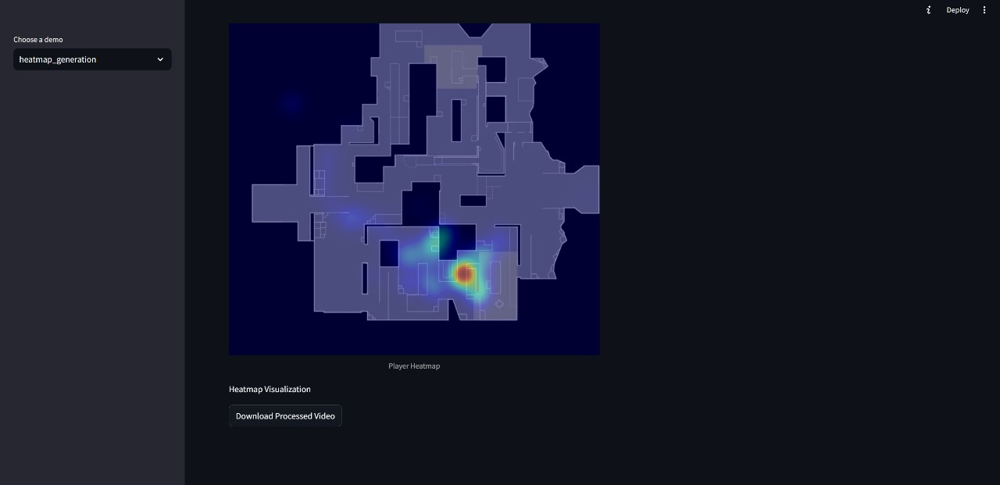

# 🎮 GameSenseAI – AI-Powered Valorant Analysis

## 📌 Overview

Gameplay Analyzer is an advanced AI-powered tool designed to analyze Valorant gameplay videos. Using computer vision and machine learning, it extracts key insights, statistics, and visualizations to help players track performance, identify patterns, and improve gameplay strategies.


## 🌟 Features

### 1. Real-time Game Analysis
- Live health and ammo monitoring
- Real-time kill detection and analysis
- Dynamic performance metrics visualization
- Player position tracking

### 2. Post-Game Statistics
- Detailed match summary
- Kill/Death analysis
- Round-by-round breakdown
- Player performance metrics
- Weapon usage statistics

### 3. AI-Powered Analysis
- Natural language interaction with game data
- AI-generated match summaries
- Intelligent highlight detection
- Context-aware gameplay insights

### 4. Visual Analytics
- Player movement heatmaps
- Interactive data visualizations
- Custom highlight reel generation
- Round performance graphs

### 5. Player Insights
- Weapon efficiency analysis
- Position and movement patterns
- Engagement behavior analysis
- Health management tracking

## 🌟 Features Showcase  







▶ **[Watch the Highlight Video](videos/gameplay_highlight.mp4)** 

## 🔧 Technical Requirements

- Python 3.8+
- OpenCV
- PyTorch
- Streamlit
- EasyOCR
- Moviepy
- Google GenerativeAI
- LangChain
- YOLO (Ultralytics)

## 📦 Installation

1. Clone the repository:
```bash
git clone https://github.com/yourusername/valorant-gameplay-analyzer.git
cd valorant-gameplay-analyzer
```

2. Install necessary required packages

3. Set up API keys:
```python
GOOGLE_API_KEY=your_google_api_key
GROQ_API_KEY=your_groq_api_key
```

## 🚀 Usage

1. Start the Streamlit application:
```bash
streamlit run stream.py --server.enableXsrfProtection false
```

2. Navigate to different analysis modules:
   - Real-time Inference
   - Overall Statistics
   - User Chatbot
   - Highlight Generator
   - Heatmap Generation

3. Upload your gameplay video and map (if required) to begin analysis.

## 🤝 Contributing

Contributions are welcome! Please feel free to submit a Pull Request.

## 📝 License

This project is licensed under the MIT License - see the [LICENSE](LICENSE) file for details.

## 🙌 Special Thanks  
 
- [Vasu Boda](https://www.linkedin.com/in/vasu-boda-93355a253/)  
- [Aarya Gopani](https://www.linkedin.com/in/aarya-gopani-99444a259/)  
- [Achyut Dave](https://www.linkedin.com/in/daveachyut/)
- [Sashrik Gupta](https://www.linkedin.com/in/sashrik-gupta-0a9210257/)

## 📬 Contact

For any questions or collaboration opportunities, reach out at:
📧 [Email](akshatvaja1303@gmail.com) | 💬 LinkedIn: [Akshat Vaja](https://www.linkedin.com/in/akshat-vaja/)

## Note

This tool is designed for educational and analytical purposes. It is not affiliated with Riot Games or Valorant.
